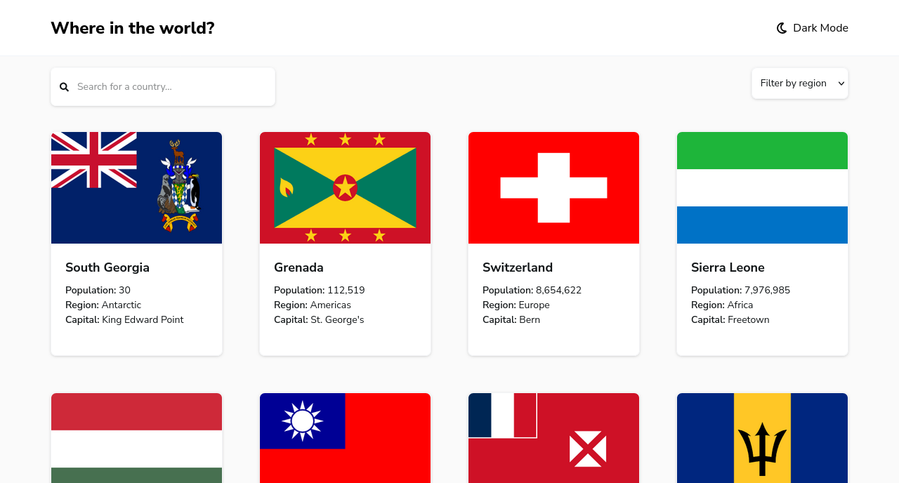
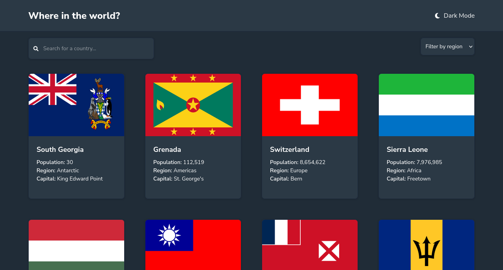

# Frontend Mentor - REST Countries API with color theme switcher solution

This is a solution to the [REST Countries API with color theme switcher challenge on Frontend Mentor](https://www.frontendmentor.io/challenges/rest-countries-api-with-color-theme-switcher-5cacc469fec04111f7b848ca). Frontend Mentor challenges help you improve your coding skills by building realistic projects. 

## Table of contents

- [Frontend Mentor - REST Countries API with color theme switcher solution](#frontend-mentor---rest-countries-api-with-color-theme-switcher-solution)
  - [Table of contents](#table-of-contents)
  - [Overview](#overview)
    - [The challenge](#the-challenge)
    - [Screenshot](#screenshot)
    - [Links](#links)
  - [My process](#my-process)
    - [Built with](#built-with)
    - [Continued development](#continued-development)
    - [Useful resources](#useful-resources)
  - [Author](#author)
  - [Acknowledgments](#acknowledgments)

**Note: Delete this note and update the table of contents based on what sections you keep.**

## Overview

### The challenge

Users should be able to:

- See all countries from the API on the homepage
- Search for a country using an `input` field
- Filter countries by region
- Click on a country to see more detailed information on a separate page
- Click through to the border countries on the detail page
- Toggle the color scheme between light and dark mode *(optional)*

### Screenshot

### Links

- Solution URL: [Frontend Mentor](https://your-solution-url.com)
- Live Site URL: [GitHub Pages](https://zenitsuag.github.io/rest-countries-master)

## My process

### Built with

- Semantic HTML5 markup
- CSS custom properties
- Flexbox
- CSS Grid
- Mobile-first workflow
- [React](https://react.dev/) - JS library
- [Tailwind CSS](https://tailwindcss.com) - CSS Framework
- [CSSFx](https://cssfx.netlify.app/) - CSS Effects
- [React Router](https://reactrouter.com/)
- [React Icons](https://react-icons.github.io/react-icons/)

### Continued development

I'm looking forward to completing more difficult projects in the future `:)`. I'll focus on deepening my knowledge of React and Vue.

### Useful resources

- [CSSFx](https://cssfx.netlify.app/) - This helped me with the CSS animation for the loading component. They have many more amazing animations there, so check them out `:)`

## Author

- Website - [Fred Robins](https://zenitsuag.github.io/portfolio)
- Frontend Mentor - [@ZenitsuAg](https://www.frontendmentor.io/profile/ZenitsuAg)
- Twitter - [@r9_freddy](https://www.twitter.com/r9_freddy)

## Acknowledgments

- I give thanks to you, God Almighty for your grace and continuous support. Without you Lord Jesus, I wouldn't have come this far.
